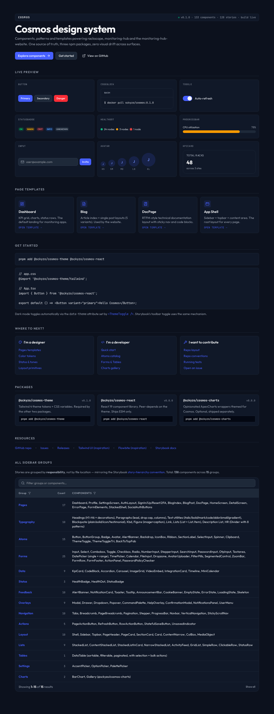

# Cosmos

Design system for sckyzo's projects — React 19 + Tailwind 4 + Storybook 10.

**Live demo:** [sckyzo.github.io/cosmos](https://sckyzo.github.io/cosmos/) — 135+ components across 15 sidebar groups, 930+ stories, dark/light theming.

<picture>
  <source media="(prefers-color-scheme: dark)" srcset="docs/images/welcome-dark.png">
  <source media="(prefers-color-scheme: light)" srcset="docs/images/welcome-light.png">
  
</picture>

Cosmos provides a shared CSS theme and a library of React components extracted
and refined from [rackscope](https://github.com/SckyzO/rackscope), reusable
across multiple projects (monitoring-hub, monitoring-hub-website, future
portals, and rackscope itself eventually).

## Packages

| Package                                    | Description                                                    | Latest |
| ------------------------------------------ | -------------------------------------------------------------- | ------ |
| [`@sckyzo/cosmos-theme`](packages/theme)   | Tailwind 4 theme — design tokens, fonts, light/dark CSS vars   | 0.1.0  |
| [`@sckyzo/cosmos-react`](packages/react)   | React 19 component library — 135+ components, ESM + CJS + DTS  | 0.0.0  |
| [`@sckyzo/cosmos-charts`](packages/charts) | Opinionated ApexCharts wrappers themed for Cosmos (separately) | 0.0.0  |

## Apps

| App                                | Purpose                                          | URL                                |
| ---------------------------------- | ------------------------------------------------ | ---------------------------------- |
| [`apps/storybook`](apps/storybook) | Component showcase + visual testing + a11y + MCP | <https://sckyzo.github.io/cosmos/> |

The Storybook is the canonical reference — every component has at least one
story, autodocs is enabled, and the **Welcome** page indexes every group via
a searchable `DataTable`.

## Sidebar groups

Stories are organised by **responsibility**, not file location (Storybook
[story-hierarchy convention](https://storybook.js.org/docs/writing-stories/naming-components-and-hierarchy)):

```
Welcome → Pages → Foundations → Typography → Atoms → Forms → Data → Status
       → Feedback → Overlays → Navigation → Actions → Layout → Lists
       → Tables → Settings → Charts
```

Notable groups:

- **Pages** — 17 full-page templates (Dashboard, Auth, Blog, DocPage, …)
- **Typography** — Headings, Paragraphs, Text utilities, Blockquote, Kbd, Figure, Link, Lists, Description List, HR
- **Forms** — 26 controls (Input, Select, Combobox, DatePicker single + range, …)
- **Charts** — `@sckyzo/cosmos-charts` (BarChart, LineArea, Donut, Sparkline, Realtime, gauges)

## Development (everything in Docker)

The host needs only `docker`, `git`, `gh`, `make`, `bash`. No Node, no pnpm,
no Playwright on the host.

```bash
make build-image    # Build cosmos-dev image (first time only)
make install        # pnpm install inside the container
make storybook      # Start Storybook on http://localhost:6006
make ci             # Run the FULL CI pipeline locally — RUN THIS BEFORE EVERY PUSH
make test           # Unit + e2e tests only
make build          # Build all package dists
make help           # See every available target
```

`make ci` mirrors `.github/workflows/ci.yml` exactly — lint + format:check +
typecheck + build + storybook:build + tests — and bails on the first failure.
Running it before `git push` catches everything CI would catch.

Alternative wrapper (`./devctl`) for ad-hoc commands:

```bash
./devctl shell                  # Interactive shell inside cosmos-dev
./devctl run pnpm <anything>    # Arbitrary pnpm command
./devctl storybook              # Storybook dev server
```

## Versions

| Tool         | Version |
| ------------ | ------- |
| Node         | 22 LTS  |
| pnpm         | 10.33.x |
| React        | 19.2.x  |
| Tailwind CSS | 4.2.x   |
| Storybook    | 10.3.x  |
| Vite         | 7.3.x   |
| TypeScript   | 6.0.x   |
| Playwright   | 1.60.x  |

## Contributing

See [CONTRIBUTING.md](CONTRIBUTING.md). All commits must be signed (SSH
signing). The repo uses Conventional Commits — `feat`, `fix`, `refactor`,
`chore`, `docs`, `test`, `build`, `ci`, `perf`, `style`, `revert`.

Two-stage refactor rule (cf. PROFILE_DEV.md) is **lifted for Cosmos**: it
currently has no published consumers, so breaking changes are merged in a
single commit rather than via deprecation cycles. For every OTHER repo in the
stack the rule still stands.

## License

MIT — see [LICENSE](LICENSE).
